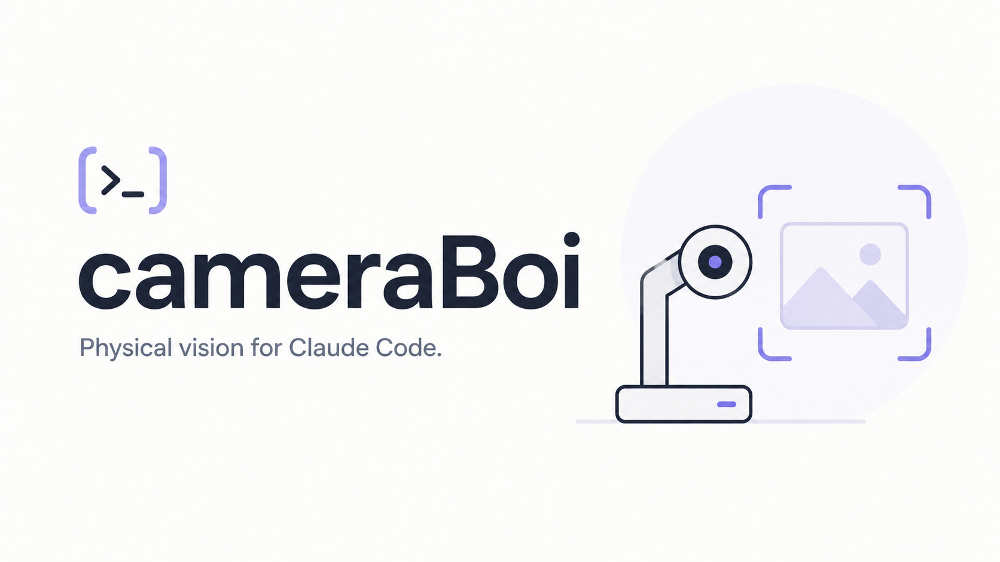

# cameraBoi



**Physical vision for Claude Code.** A Claude Code skill plus a single bash CLI that lets a
Claude session take a photo, record a clip, or watch a scene through the camera attached to
your Mac — and then actually look at what it captured.

Built around an [IPEVO V4K](https://www.ipevo.com/) document camera by default, but any
AVFoundation device works, including the built-in MacBook camera. macOS only; `ffmpeg` is
the only dependency — no build step, no package manager, no runtime beyond bash.

## Quick start

```bash
brew install ffmpeg
```

Grant camera access to whichever terminal app you run the CLI from under
**System Settings → Privacy & Security → Camera** — the permission belongs to the terminal
app, not to cameraBoi. Then:

```bash
scripts/cameraboi doctor                                    # verify ffmpeg, device, live capture
ln -s "$PWD/skills/cameraboi" ~/.claude/skills/cameraboi    # install the skill (symlink, not copy)
```

Start a new Claude Code session and ask:

> use cameraBoi to take a picture and tell me what you see

## What's in the box

| Piece | What it does |
|---|---|
| `scripts/cameraboi` | The capture CLI — `snap` stills, `record` video, `burst` timelapse, `frames` contact sheets, plus `devices`, `logs`, `clean`, `doctor` |
| `scripts/cameraboi-cv` | Deterministic CV on top of the captures — calibrated millimeter measurement on an ArUco mat, exact object counting, batch document scanning |
| MCP vision servers | `vlm` (local Qwen3-VL — captioning, VQA, bounding boxes), `ocr` (Apple Vision text extraction), `moondream` (legacy fallback) — no API keys, captures never leave the machine |
| `skills/cameraboi/` | The Claude Code skill that ties it all together |

## How the vision loop works

Claude cannot see a camera. It can see an image file. So every workflow is: run a command,
read the path it printed. The CLI's contract makes this mechanical — **the last stdout
line(s) are the absolute paths of the artifacts produced**; failures exit non-zero with
diagnostics on stderr, never contaminating the artifact block.

```bash
IMG=$(scripts/cameraboi snap | tail -1)
```

Stills are read directly. Video goes through `frames --sheet`, which tiles evenly spaced
frames into contact sheets so a whole clip reads as one or two images. Slow-changing scenes
use `burst` stills instead of video. Captures land in `~/Pictures/cameraboi/`.

## Docs

| Doc | What |
|---|---|
| [docs/getting-started.md](docs/getting-started.md) | Setup, permissions, first capture |
| [docs/command-reference.md](docs/command-reference.md) | Every command, option, and default |
| [docs/skill-usage.md](docs/skill-usage.md) | Using the Claude Code skill |
| [docs/cv-tools.md](docs/cv-tools.md) | Measurement/counting/scanning setup and the accuracy contract |
| [docs/mcp-vision.md](docs/mcp-vision.md) | The MCP vision servers — tools, arguments, when to use which |
| [docs/troubleshooting.md](docs/troubleshooting.md) | The three failure modes and their three different fixes — start with `doctor` |
